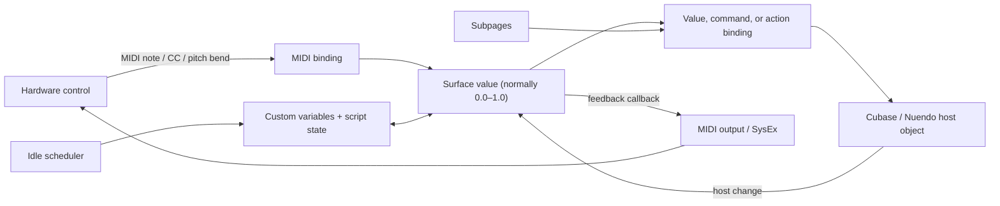

# Cubase MIDI Remote scripting: a practical, code-backed guide

This guide explains how to design a Steinberg Cubase/Nuendo MIDI Remote script by working backward from three real controllers:

- [Tascam US-428](../Tascam_US-428.js) — the richest example of coordinated subpages, mode layers, manual channel banks, EQ/send selection, and device-specific SysEx feedback.
- [Tascam US-224](../Tascam_US-224.js) — the broadest example of feature flags, two intended workflow profiles, manual banking, button chords, delayed actions, long-press handling, and tempo-driven LEDs.
- [Korg nanoKONTROL2](../Korg_nanoKontrol2Remote.js) — the cleanest compact example, with generated channel strips, identity-based detection, startup SysEx, fixed mixer channels, custom routing, CC LED feedback, and long-press Save.

It is a field guide to the API patterns exercised by this repository, not a substitute for the complete Steinberg API reference. The bundled [`midiremote_api_v1.d.ts`](../api/midiremote_api_v1.d.ts) remains the most precise local catalog of available objects and methods.

## Contents

1. [The mental model](#1-the-mental-model)
2. [Compatibility and the development loop](#2-compatibility-and-the-development-loop)
3. [A maintainable script structure](#3-a-maintainable-script-structure)
4. [A minimal working script](#4-a-minimal-working-script)
5. [Driver setup and device detection](#5-driver-setup-and-device-detection)
6. [Surface elements and MIDI bindings](#6-surface-elements-and-midi-bindings)
7. [Host access and the three binding types](#7-host-access-and-the-three-binding-types)
8. [Mixer channels, selected-track access, and banking](#8-mixer-channels-selected-track-access-and-banking)
9. [Subpages as independent state machines](#9-subpages-as-independent-state-machines)
10. [Custom variables, routing, chords, and mirrored state](#10-custom-variables-routing-chords-and-mirrored-state)
11. [Relative controls and direction-sensitive commands](#11-relative-controls-and-direction-sensitive-commands)
12. [Timers, long presses, delayed actions, and animation](#12-timers-long-presses-delayed-actions-and-animation)
13. [LED and hardware feedback](#13-led-and-hardware-feedback)
14. [Lifecycle and initialization](#14-lifecycle-and-initialization)
15. [Feature flags and defensive compatibility](#15-feature-flags-and-defensive-compatibility)
16. [Debugging playbook](#16-debugging-playbook)
17. [Reusable recipes](#17-reusable-recipes)
18. [API quick reference](#18-api-quick-reference)
19. [What each project teaches](#19-what-each-project-teaches)
20. [Design checklist](#20-design-checklist)

## 1. The mental model

A MIDI Remote script is a mediator with three main layers:

1. **Driver setup** identifies one kind of hardware and its MIDI ports.
2. **Surface layout** models the physical controls and translates MIDI messages into normalized surface values.
3. **Host mapping** connects those surface values to Cubase values, commands, and actions.

The working scripts add two important layers of their own:

4. **State and routing** turn one control into several context-sensitive controls.
5. **Feedback and lifecycle** keep LEDs and device configuration synchronized with Cubase.



The distinction between a **surface value** and a **host value** is fundamental:

| Concept | Represents | Typical examples |
| --- | --- | --- |
| Surface element | Something visible in the MIDI Remote surface editor | Button, knob, fader, label |
| Surface value | The normalized state of a physical or virtual control | `button.mSurfaceValue`, a custom trigger variable |
| Host object/value | Something in Cubase | Selected-track volume, transport Record, send level |
| Host action | A typed operation exposed by the API | Select next track, activate a subpage |
| Command | A named Cubase Key Command | `Edit / Undo`, `File / Save` |
| Binding | The connection between a surface value and a host target | Value, command, or action binding |
| Script state | JavaScript data not automatically known to Cubase | Current cycle marker, timer deadline, active logical bank |

Most incoming MIDI is normalized by the API. A button is commonly `0` on release and positive on press; a fader or absolute knob is normally represented from `0.0` to `1.0`. Device output still uses raw MIDI bytes, so feedback code converts the normalized value back to `0..127` or wraps it in a manufacturer-specific SysEx message.

## 2. Compatibility and the development loop

### API and host versions

All three scripts load:

```javascript
var midiremote_api = require('midiremote_api_v1')
```

The `v1` module name covers several compatible API revisions. The core driver/surface/mapping model began with API 1.0. Idle callbacks and touch-state support arrived in API 1.1. That matters here because US-224 long-press, delayed-audition, and LED animation logic depends on `mOnIdle`; the Korg uses it for long-press Save and confirmation blinking. On a host that does not call idle callbacks, the ordinary bindings can still work while the timed behavior does not.

For maximum compatibility, target the officially documented ES5 JavaScript subset:

- Prefer `var` and classic `function (...) { ... }` syntax.
- Avoid modules other than Cubase's supported `require(...)` pattern.
- Feature-detect members added by later API revisions before using them.
- Treat newer syntax found in a working local script as host-tested, not as a portable API guarantee.

### Install and reload

Cubase/Nuendo creates its MIDI Remote script directory after the MIDI Remote panel has been opened at least once. A local script follows this shape:

```text
<Driver Scripts>/Local/<vendor>/<device>/<vendor>_<device>.js
```

Typical roots are:

```text
Windows: C:\Users\<Username>\Documents\Steinberg\<Cubase or Nuendo>\MIDI Remote\Driver Scripts
macOS:   /Users/<Username>/Documents/Steinberg/<Cubase or Nuendo>/MIDI Remote/Driver Scripts
```

A practical edit/test loop is:

1. Connect the controller and verify its input/output port names.
2. Open a small Cubase project containing representative audio, instrument, group, FX, and output channels.
3. Open MIDI Remote and its Script Console.
4. Edit the script, then use **Reload Scripts**.
5. Test input, host behavior, and feedback as separate concerns.
6. Before reloading, optionally run `node --check YourScript.js` to catch plain JavaScript syntax errors. Node cannot validate Cubase API object names or command names.

The [local API type definition](../api/midiremote_api_v1.d.ts) is useful for completion and callback signatures even though Cubase executes JavaScript, not TypeScript.

## 3. A maintainable script structure

The following order scales from the nanoKONTROL2 to the US-428:

1. **User settings** — behavior flags, bank sizes, ranges, time thresholds.
2. **Driver setup** — API import, device driver, ports, detection.
3. **Device protocol** — CC numbers, note numbers, SysEx prefixes, LED codes.
4. **Runtime state** — active modes, timers, cached values, animation state.
5. **Surface construction** — buttons, knobs, faders, labels.
6. **MIDI input bindings** — hardware messages to surface values.
7. **Feedback helpers** — raw MIDI/SysEx output and LED rendering.
8. **Host page and host references** — transport, track selection, mixer zones.
9. **Custom variables and subpages** — routing and mode topology.
10. **Assignment functions** — focused functions that create bindings.
11. **Scheduler** — one composed idle callback for all timed work.
12. **Main assembly** — call every setup function in a readable order.
13. **Lifecycle callbacks** — initialize hardware and runtime state.

Why order matters:

- A mapping page must exist before `page.mHostAccess`, `page.mCustom`, or subpages can be used.
- A subpage must exist before a binding can call `setSubPage(...)`.
- A host mixer zone must exist before it can create mixer-bank channels.
- JavaScript function declarations are hoisted, but API objects created by function calls are not.
- Assigning a callback property a second time replaces the first callback; setup order can silently change behavior.

The nanoKONTROL2's builder functions are a strong model for repeated hardware. [`makeFaderStrip`](../Korg_nanoKontrol2Remote.js#L181) creates, positions, labels, and MIDI-binds one strip, while [`makeSurfaceElements`](../Korg_nanoKontrol2Remote.js#L255) assembles the device.

## 4. A minimal working script

This ES5-style skeleton shows the complete data path for a fader and a Play button:

```javascript
var api = require('midiremote_api_v1')
var driver = api.makeDeviceDriver('Example Vendor', 'Example Controller', 'Your Name')

var midiIn = driver.mPorts.makeMidiInput()
var midiOut = driver.mPorts.makeMidiOutput()

driver.makeDetectionUnit()
    .detectPortPair(midiIn, midiOut)
    .expectInputNameContains('Example Controller')
    .expectOutputNameContains('Example Controller')

var surface = driver.mSurface
var fader = surface.makeFader(0, 0, 1.5, 6).setTypeVertical()
var playButton = surface.makeButton(2, 0, 2, 1)

fader.mSurfaceValue.mMidiBinding
    .setInputPort(midiIn)
    .bindToControlChange(0, 7)

playButton.mSurfaceValue.mMidiBinding
    .setInputPort(midiIn)
    .bindToControlChange(0, 41)

var page = driver.mMapping.makePage('Main')
var selectedChannel = page.mHostAccess.mTrackSelection.mMixerChannel
var transportStart = page.mHostAccess.mTransport.mValue.mStart

page.makeValueBinding(fader.mSurfaceValue, selectedChannel.mValue.mVolume)
    .setValueTakeOverModeScaled()

page.makeValueBinding(playButton.mSurfaceValue, transportStart)
    .setTypeToggle()

playButton.mSurfaceValue.mOnProcessValueChange = function (activeDevice, value) {
    midiOut.sendMidi(activeDevice, [0xB0, 41, value > 0 ? 127 : 0])
}

driver.mOnActivate = function (activeDevice) {
    midiOut.sendMidi(activeDevice, [0xB0, 41, 0])
}
```

The coordinates only determine how controls appear in Cubase. The CC bindings determine what MIDI drives them. The mapping page determines what they do.

## 5. Driver setup and device detection

### Create the driver and ports

Every script begins with one driver plus the MIDI ports it owns:

```javascript
var api = require('midiremote_api_v1')
var driver = api.makeDeviceDriver('Tascam', 'US-428', 'Paul Warner')
var midiInput = driver.mPorts.makeMidiInput()
var midiOutput = driver.mPorts.makeMidiOutput()
```

Use a stable vendor/device identity. Cubase uses this metadata in its MIDI Remote UI and script management.

### Name-based detection

The Tascam scripts use a permissive match for one connected unit:

```javascript
driver.makeDetectionUnit().detectPortPair(midiInput, midiOutput)
    .expectInputNameContains('US-428 Control')
    .expectOutputNameContains('US-428 Control')
```

They switch to exact names when several same-model units may be present. Each alternative is a separate detection unit:

```javascript
for (var i = 0; i < exactPortNames.length; i++) {
    driver.makeDetectionUnit().detectPortPair(midiInput, midiOutput)
        .expectInputNameEquals(exactPortNames[i])
        .expectOutputNameEquals(exactPortNames[i])
}
```

Use `Contains` when operating-system prefixes and suffixes vary but the identifying substring is safe. Use `Equals` when two devices would otherwise collide.

### Identity-reply detection

The nanoKONTROL2 uses the device's Universal Identity Reply instead of relying on port text:

```javascript
driver.makeDetectionUnit().detectPortPair(midiInput, midiOutput)
    .expectSysexIdentityResponse('42', '1301', '0000')
```

The strings encode manufacturer, family, and model fields in hexadecimal. Capture and verify the actual reply for a different controller; do not copy another device's values.

### Startup configuration

Some hardware must be placed in a known mode. The Korg script keeps the configuration packets in one function, then calls it from `driver.mOnActivate`:

```javascript
driver.mOnActivate = function (activeDevice) {
    if (FORCE_DEVICE_CC_MODE) {
        switchDeviceToCcModeWithExternalLed(activeDevice)
    }
}
```

This makes reconnection deterministic. Keep large device dumps separate from mapping code, document where the bytes came from, and send them only when necessary.

## 6. Surface elements and MIDI bindings

### Surface coordinates are a GUI model

The common factories used here are:

```javascript
var button = surface.makeButton(x, y, width, height)
var knob = surface.makeKnob(x, y, width, height)
var fader = surface.makeFader(x, y, width, height).setTypeVertical()
var label = surface.makeLabelField(x, y, width, height)
```

Coordinates are arbitrary layout units. They should communicate the real hardware's grouping and order; they do not alter MIDI behavior.

Labels can be static or associated with controls:

```javascript
label.relateTo(button)
label.relateTo(fader)
page.setLabelFieldText(label, 'METRONOME')
```

### Bind MIDI after creating the control

An absolute CC binding:

```javascript
fader.mSurfaceValue.mMidiBinding
    .setInputPort(midiInput)
    .bindToControlChange(0, 7)
```

A two's-complement relative CC binding, used by the Tascam knobs and wheel:

```javascript
knob.mSurfaceValue.mMidiBinding
    .setInputPort(midiInput)
    .bindToControlChange(15, 77)
    .setTypeRelativeTwosComplement()
```

The API channel argument is zero-based: `0` is MIDI channel 1 and `15` is MIDI channel 16. Keep protocol constants in one section so that a hardware revision does not require edits throughout the mapping code.

### Absolute versus relative controls

| Hardware behavior | Binding |
| --- | --- |
| Sends an absolute value from 0 to 127 | `bindToControlChange(...).setTypeAbsolute()` or the default |
| Sends signed-bit relative increments | `setTypeRelativeSignedBit()` |
| Sends binary-offset relative increments | `setTypeRelativeBinaryOffset()` |
| Sends two's-complement relative increments | `setTypeRelativeTwosComplement()` |
| Sends high-resolution data | Use the appropriate 14-bit CC, NRPN, or pitch-bend binding |

Determine the encoding with a MIDI monitor. A wrong relative mode often looks like jumps, reversed steps, or motion in only one direction.

### Input and output ports are separate decisions

Setting an input port lets hardware drive the surface value. Setting an output port lets the binding participate in MIDI output for compatible protocols. The Tascam scripts deliberately omit `setOutputPort(...)` on surface bindings and generate their proprietary SysEx feedback themselves. The Korg can use ordinary CC feedback.

When feedback is custom, keeping the input binding input-only makes the output path explicit and avoids assuming that Cubase's generic output matches the device's LED protocol.

### Generate repeated controls

For an eight-strip controller, return an object per strip:

```javascript
function makeStrip(index, x, y) {
    var strip = {}
    strip.fader = surface.makeFader(x + index * 4, y, 1.5, 6).setTypeVertical()
    strip.mute = surface.makeButton(x + index * 4, y + 7, 1.5, 1)

    strip.fader.mSurfaceValue.mMidiBinding
        .setInputPort(midiInput)
        .bindToControlChange(0, index)

    strip.mute.mSurfaceValue.mMidiBinding
        .setInputPort(midiInput)
        .bindToControlChange(0, 48 + index)

    return strip
}
```

This keeps visual ordering, MIDI numbering, and later host assignment indexed by the same strip number.

## 7. Host access and the three binding types

Create one or more mapping pages after the surface exists:

```javascript
var page = driver.mMapping.makePage('Main')
```

Frequently used host roots in this repository include:

```javascript
var transport = page.mHostAccess.mTransport
var selected = page.mHostAccess.mTrackSelection.mMixerChannel
var trackActions = page.mHostAccess.mTrackSelection.mAction
var mixConsole = page.mHostAccess.mMixConsole
var quickControls = page.mHostAccess.mFocusedQuickControls
```

### Value binding

Use a value binding for state or a continuous parameter:

```javascript
page.makeValueBinding(fader.mSurfaceValue, selected.mValue.mVolume)
    .setValueTakeOverModeScaled()

page.makeValueBinding(muteButton.mSurfaceValue, selected.mValue.mMute)
    .setTypeToggle()
```

### Command binding

Use a command binding for a named Cubase Key Command:

```javascript
page.makeCommandBinding(saveTrigger, 'File', 'Save')
page.makeCommandBinding(undoTrigger, 'Edit', 'Undo')
page.makeCommandBinding(markerButton.mSurfaceValue, 'Transport', 'Insert Marker')
```

Category and command strings must match commands exposed by the target Cubase/Nuendo version. Copy them from Cubase's MIDI Remote/Key Commands tooling instead of inventing names.

### Action binding

Use an action binding for a typed action exposed directly by the API:

```javascript
page.makeActionBinding(previousButton.mSurfaceValue,
    page.mHostAccess.mTrackSelection.mAction.mPrevTrack)

page.makeActionBinding(modeButton.mSurfaceValue,
    targetSubPage.mAction.mActivate)
```

Actions are especially important for subpage activation and mixer-bank navigation.

### Which binding should I choose?

| Need | Binding |
| --- | --- |
| Read/write a persistent host parameter | Value |
| Toggle Mute, Solo, Record Enable, Cycle, or a similar host value | Value + `setTypeToggle()` |
| Invoke a named Key Command | Command |
| Invoke an API-exposed navigation or activation operation | Action |
| Run custom decision logic first | Intercept into a custom surface value, then bind that value |

### Takeover and range mapping

The value-binding methods used in this project are:

| Method | Practical effect |
| --- | --- |
| `setValueTakeOverModeJump()` | The host jumps to the physical value immediately |
| `setValueTakeOverModePickup()` | The control must cross the current host value before taking over |
| `setValueTakeOverModeScaled()` | Movement is scaled from the current relationship, useful when controls change targets |
| `mapToValueRange(from, to)` | Restricts/remaps the normalized host range |
| `setTypeToggle()` | Treats presses as state toggles |

In the optional dual-mode Tascam master-fader branch, the Stereo Out mapping uses `0..0.75` so its top is near 0 dB instead of the host parameter's full positive-gain range:

```javascript
page.makeValueBinding(masterFader.mSurfaceValue, stereoOut.mValue.mVolume)
    .setValueTakeOverModeScaled()
    .mapToValueRange(0, 0.75)
```

### Callback families

The same word “value” appears in several callback types. Their signatures differ:

| Callback | Signature | Best use |
| --- | --- | --- |
| Surface value | `function (activeDevice, value, diff)` | Raw/intercepted control changes and MIDI feedback |
| Host value | `function (activeDevice, activeMapping, value)` | Observe a Cubase parameter directly |
| Binding | `function (activeDevice, activeMapping, value, diff)` | React to the mapped connection and access `activeMapping` |
| Page lifecycle | `function (activeDevice, activeMapping)` | Mapping-specific setup and scheduler work |
| Driver lifecycle | `function (activeDevice)` | Device configuration and device-only scheduler work |

The source often names `activeDevice` as `context`. It is the object required by `getProcessValue`, `setProcessValue`, and `midiOutput.sendMidi`.

Each `mOn...` member is a single function property, not an event-listener collection. If two features assign `button.mSurfaceValue.mOnProcessValueChange`, the later assignment wins. Combine the logic in one dispatcher or introduce a separate mirrored/custom value.

## 8. Mixer channels, selected-track access, and banking

There are three useful mixer-addressing strategies in this repository.

### Follow the selected track

Use the selected-track channel when a physical “channel strip” should follow Cubase selection:

```javascript
var selectedChannel = page.mHostAccess.mTrackSelection.mMixerChannel

page.makeValueBinding(volume.mSurfaceValue, selectedChannel.mValue.mVolume)
    .setValueTakeOverModeScaled()

page.makeValueBinding(mute.mSurfaceValue, selectedChannel.mValue.mMute)
    .setTypeToggle()
```

The Korg's eighth strip uses this for selected-track Mute and Solo, while its fader controls metronome level. This “utility strip” pattern is useful when most strips are fixed but one should follow focus.

### Create a fixed strip bank

A mixer bank zone produces sequential channel objects:

```javascript
var bankZone = page.mHostAccess.mMixConsole.makeMixerBankZone()
    .excludeInputChannels()
    .excludeOutputChannels()
    .excludeSamplerChannels()
    .excludeVCAChannels()

var channels = []
for (var i = 0; i < 8; i++) {
    channels.push(bankZone.makeMixerBankChannel())
}
```

Each call to `makeMixerBankChannel()` allocates the next channel represented by that zone. The Korg creates eight zone channels even when strip 8 is repurposed, so only seven of those channel objects are mapped. Remember that the zone's logical width and the number of ordinary physical strips can differ.

Zone filters define eligibility. Do not describe the result as “audio and group only” unless every other category has actually been excluded. Test the zone with the channel types used by real projects.

### Preallocate channels and page them manually

The Tascam scripts allocate a flat channel array and use subpages to expose a portion of it:

```javascript
var BANK_SIZE = 8
var BANK_COUNT = 3
var channels = []

for (var i = 0; i < BANK_SIZE * BANK_COUNT; i++) {
    channels.push(bankZone.makeMixerBankChannel())
}

function getChannel(bank, slot) {
    return channels[bank * BANK_SIZE + slot]
}
```

The US-428 maps F1/F2/F3 to fixed groups 1–8, 9–16, and 17–24. It is not shifting `MixerBankZone.mAction.mPrevBank` or `mNextBank`. Likewise, its Bank Left/Right hardware buttons select the previous/next track; they do not change the eight-fader bank.

The US-224 Normal profile generalizes the same arithmetic to a configurable number of four-channel banks. Large preallocated banks are simple to reason about but create many host objects and bindings at load time. Choose a realistic maximum and test script reload time.

### Separate special-purpose zones

Output, FX, group, and main mixer channels can be modeled with separate zones:

```javascript
var outputZone = page.mHostAccess.mMixConsole.makeMixerBankZone()
    .includeOutputChannels()
var stereoOut = outputZone.makeMixerBankChannel()

var fxZone = page.mHostAccess.mMixConsole.makeMixerBankZone()
    .includeFXChannels()
var firstFxChannel = fxZone.makeMixerBankChannel()
```

This is how a master fader can target Stereo Out in one mode and an FX channel in another without contaminating the main strip zone.

### Keep feedback bank-aware

Every host channel remains live even when its subpage is hidden. A callback for a hidden channel must not overwrite an LED that currently represents a visible channel:

```javascript
hostChannel.mValue.mMute.mOnProcessValueChange =
    function (activeDevice, activeMapping, value) {
        if (selectedBank !== this.bank) return
        sendMuteLed(activeDevice, this.slot, value > 0)
    }.bind({ bank: bank, slot: slot })
```

For strict ES5 style, write the object explicitly as `{ bank: bank, slot: slot }`. A callback factory is another safe way to capture loop indices.

Filtering hidden-bank callbacks prevents incorrect live updates, but it can leave a bank stale when it becomes visible. On bank activation, either rely on the host republishing current values only after testing that behavior, or explicitly render the bank from mirrored state.

## 9. Subpages as independent state machines

Subpages are the most important advanced pattern in the US-428.

### One area is one mutually exclusive axis

Create a subpage area, then create each possible state inside it:

```javascript
var panArea = page.makeSubPageArea('Pan mode')
var panNormal = panArea.makeSubPage('Pan')
var panAssign = panArea.makeSubPage('Selected-track volume')

page.makeValueBinding(panKnob.mSurfaceValue, selected.mValue.mPan)
    .setValueTakeOverModeScaled()
    .setSubPage(panNormal)

page.makeValueBinding(panKnob.mSurfaceValue, selected.mValue.mVolume)
    .setValueTakeOverModeScaled()
    .setSubPage(panAssign)
```

Only one subpage in that area is active at a time. Subpages in other areas are independent and may be active simultaneously.

This is the key to avoiding a Cartesian explosion. Do not create giant modes such as “Bank 2 + Solo + Assign + EQ High.” Create separate axes for Bank, Mute/Solo, Assign, and EQ Band, then coordinate only the axes that a gesture changes.

### The US-428 subpage graph

The US-428 defines 11 areas containing 37 subpages:

| Area | Count | State represented |
| --- | ---: | --- |
| Rec Master | 2 | Normal / ASGN |
| Pan knob | 2 | Pan / selected-track volume |
| Locator buttons | 2 | Marker operations / locator operations |
| AUX buttons | 2 | Select send / toggle send |
| Jog wheel | 5 | Send 1–4 level / Zoom |
| EQ buttons | 2 | Select band / toggle band |
| EQ knobs | 4 | High / High Mid / Low Mid / Low |
| Faders | 3 | F1 / F2 / F3 bank |
| Select LEDs | 3 | F1 / F2 / F3 bank |
| Select/Record row | 6 | Three banks × two meanings |
| Mute/Solo row | 6 | Three banks × two meanings |

The construction is visible in [the US-428 subpage section](../Tascam_US-428.js#L614). This is a substantially more useful real-world example than a single modifier layer.

With the shipped `LOW_EQ_PREFILTER_MODE = true` setting, the page labelled Low is not ordinary EQ Band 1: its knobs address prefilter Gain, Low Cut Frequency, and Low Cut Slope, and its button toggles Low Cut. Treat the table as the selector topology, then document the actual target behind each page.

### Scope each binding

A single AUX button has two mappings that never compete:

```javascript
page.makeValueBinding(auxButton.mSurfaceValue, selected.mSends.getByIndex(send).mOn)
    .setTypeToggle()
    .setSubPage(auxAssignMode)

page.makeActionBinding(auxButton.mSurfaceValue, sendJogPage.mAction.mActivate)
    .setSubPage(auxSelectMode)
```

In Select mode it chooses what the wheel controls. In Assign mode it toggles the send. EQ buttons use the same “select versus enable” design.

If competing bindings are scoped to subpages from different areas, both areas can be active and both bindings may fire. Mutually exclusive roles for the same physical control should normally be placed within one area or protected by explicit state guards.

### Activate subpages

A physical control can activate a subpage through an action binding:

```javascript
page.makeActionBinding(modeButton.mSurfaceValue, panAssign.mAction.mActivate)
```

Code can activate it imperatively when `activeMapping` is available:

```javascript
panAssign.mAction.mActivate.trigger(activeMapping)
```

Direct surface callbacks do not receive `activeMapping`. When raw control logic must lead to programmatic subpage activation, route the control through a binding callback or perform the work from a page callback.

### Coordinate several areas from one mode button

The US-428 uses complementary custom surface variables as an ON/OFF “rail.” Each rail first activates one subpage through an action binding. The binding callback now has `activeMapping` and fans the change out:

```javascript
page.makeActionBinding(assignOn, auxAssign.mAction.mActivate)
    .mOnValueChange = function (activeDevice, activeMapping, value) {
        if (value <= 0) return
        eqAssign.mAction.mActivate.trigger(activeMapping)
        recMasterAssign.mAction.mActivate.trigger(activeMapping)
        panAssign.mAction.mActivate.trigger(activeMapping)
        locatorsAssign.mAction.mActivate.trigger(activeMapping)
        zoomMode.mAction.mActivate.trigger(activeMapping)
    }
```

The OFF rail activates the corresponding normal pages and restores the last selected AUX page. The two-rail pattern is helpful because either transition creates a positive event that can drive an action binding.

### Coordinate bank changes centrally

Changing a visible bank affects several independent areas. Put that transaction in one function:

```javascript
function activateBank(activeDevice, activeMapping, bank) {
    faderPages[bank].mAction.mActivate.trigger(activeMapping)
    selectedLedPages[bank].mAction.mActivate.trigger(activeMapping)

    if (soloMode) {
        soloPages[bank].mAction.mActivate.trigger(activeMapping)
        recordPages[bank].mAction.mActivate.trigger(activeMapping)
    } else {
        mutePages[bank].mAction.mActivate.trigger(activeMapping)
        selectPages[bank].mAction.mActivate.trigger(activeMapping)
    }
}
```

This prevents a half-switched controller in which faders show one bank while LEDs or buttons address another.

This example follows the US-428's role pairing: SOLO mode makes the shared rows Solo and Record Enable; normal mode makes them Mute and Select. A different controller can deliberately pair Solo with Select and Mute with Record Enable instead. Name the pages after their actual host targets and make the user-facing mode summary match the activation branches.

### Creation order and startup

These scripts treat the first-created subpage in each area as the initial one. Make the intended default first, but do not rely on construction order alone for a complex device. In `page.mOnActivate(activeDevice, activeMapping)`:

1. Initialize logical mode values.
2. Explicitly activate the intended subpages.
3. Re-seed cached encoder values.
4. Render LEDs from the resulting state.

The current US-428 initializes `lastSelectedEQBand` to Low but creates the High EQ-knob subpage first. That is exactly the kind of LED/control mismatch explicit startup activation prevents.

Use `subpage.mOnActivate` to update labels, remember the selection, re-seed direction tracking, or render LEDs:

```javascript
eqLow.mOnActivate = function (activeDevice, activeMapping) {
    selectedEqBand = EQ_LOW
    renderEqLeds(activeDevice)
}
```

## 10. Custom variables, routing, chords, and mirrored state

### Surface custom values versus host custom values

The API exposes two easily confused tools:

| Created with | Side | Typical role in these scripts |
| --- | --- | --- |
| `surface.makeCustomValueVariable(name)` | Surface | Synthetic button, command pulse, mode rail, intercepted input |
| `page.mCustom.makeHostValueVariable(name)` | Host | Dummy endpoint for a value binding whose callback needs `activeMapping` |

A surface custom value can be the first argument to `makeValueBinding`, `makeCommandBinding`, or `makeActionBinding`. Set it from script code with `setProcessValue(activeDevice, value)`.

A host custom value is normally the second argument of a value binding:

```javascript
var bankButtonHost = page.mCustom.makeHostValueVariable('Bank button')

page.makeValueBinding(bankButton.mSurfaceValue, bankButtonHost)
    .mOnValueChange = function (activeDevice, activeMapping, value) {
        if (value > 0) activateBank(activeDevice, activeMapping, nextBank)
    }
```

### Treat state and events differently

A Mute value is state: leaving it at `1` means muted.

A Save or Undo trigger is an event. Represent it as a pulse so repeated invocations always contain an edge:

```javascript
function pulse(activeDevice, variable) {
    variable.setProcessValue(activeDevice, 1)
    variable.setProcessValue(activeDevice, 0)
}
```

The cycle-marker and Save paths use this robust pattern. Some existing paths only write `1` to RTZ, Undo, Redo, or Zoom variables. Do not copy that inconsistency into a new script.

### Route a physical control through virtual controls

This is the general chord/interceptor pipeline:

```text
physical button callback
    → inspect current mode/modifier state
    → update one of several custom surface variables
    → ordinary Cubase binding handles the chosen event
```

Example:

```javascript
var rewindProxy = surface.makeCustomValueVariable('Rewind')
var rtzTrigger = surface.makeCustomValueVariable('Return to Zero')

page.makeValueBinding(rewindProxy, page.mHostAccess.mTransport.mValue.mRewind)
page.makeCommandBinding(rtzTrigger, 'Transport', 'Return to Zero')

rewindButton.mSurfaceValue.mOnProcessValueChange =
    function (activeDevice, value) {
        var pressed = value > 0
        var stopDown = stopButton.mSurfaceValue.getProcessValue(activeDevice) > 0

        if (pressed && stopDown) {
            cancelStopLongPress(activeDevice)
            pulse(activeDevice, rtzTrigger)
        } else {
            rewindProxy.setProcessValue(activeDevice, value)
        }
    }
```

This chord is order-dependent: STOP must already be held when REW changes. If REW is pressed first, then STOP, the REW callback never sees the combination.

In these scripts STOP performs its normal action immediately, before the second chord button arrives. This is a deliberate UX compromise. If STOP must be suppressed whenever it becomes a modifier, defer the short action until a small chord window expires; that produces a different and more complex gesture design.

### Cancel competing gestures

Every alternate STOP chord in the later scripts cancels the armed STOP long press. Without that reset, holding STOP while using Undo, marker navigation, or audition could also Save the project.

Use one cancellation function and call it from every chord branch:

```javascript
function cancelStopLongPress(activeDevice) {
    stopHoldArmed = false
    stopHoldStartedAt = -1
    clearStopProgress(activeDevice)
}
```

### Mirror host state when callback logic must query it

The US-224 needs to know whether Cycle is active while processing a STOP+Bank chord. It binds a silent custom value to host Cycle state and mirrors the binding callback into a JavaScript boolean.

A dummy surface element can also subscribe to a host value independently of the physical control's current role. Examples include:

- A dummy selected-track Mute value that a chord can read and invert.
- Dummy Select values that keep selection LEDs alive while the physical row is temporarily assigned to another role, such as Record Enable.
- A separate STOP LED variable bound to persistent transport Stop state while the physical STOP value is intercepted for long-press logic.

These are not hacks to hide; they are adapters between persistent host state, physical input, and feedback.

### Keep callback ownership explicit

Only one function can occupy `mOnProcessValueChange`. A setup function that installs LED feedback and a later setup function that installs input routing on the same surface value will overwrite the first one.

Use one of these designs:

1. One callback calls both `routeInput(...)` and `renderFeedback(...)`.
2. Persistent feedback listens to a separate custom/dummy surface value.
3. A host-value callback owns the LED, while the physical callback owns gesture routing.

The Korg STOP path uses option 2. Other Korg transport paths demonstrate the overwrite risk and should not be copied unchanged.

## 11. Relative controls and direction-sensitive commands

A relative encoder should first be decoded at the MIDI layer:

```javascript
encoder.mSurfaceValue.mMidiBinding
    .setInputPort(midiInput)
    .bindToControlChange(15, 96)
    .setTypeRelativeTwosComplement()
```

If the callback's `diff` is reliable for the controller/API combination, direction routing can be simple:

```javascript
encoder.mSurfaceValue.mOnProcessValueChange =
    function (activeDevice, value, diff) {
        if (diff > 0) pulse(activeDevice, zoomIn)
        if (diff < 0) pulse(activeDevice, zoomOut)
    }
```

The scripts instead compare the current normalized process value with a cached previous value. This empirical workaround also handles absolute knobs pressed into service as repeated Zoom commands:

```javascript
var lastValue = -1

function routeDirection(activeDevice, value) {
    var current = Math.floor(value * 1000)
    if (lastValue >= 0) {
        if (current > lastValue) pulse(activeDevice, zoomIn)
        if (current < lastValue) pulse(activeDevice, zoomOut)
    }
    lastValue = current
}
```

That approach has tradeoffs:

- An absolute knob eventually reaches an endpoint, so no further movement is available in that direction.
- Jitter can generate alternating commands.
- A stale `lastValue` can cause a false command immediately after changing modes/subpages.
- Special endpoint clauses can repeatedly fire while the value remains at 0 or 1.

The US-224 re-seeds `lastZoomValue` from the current physical process value when returning to the Zoom subpage. Do the same whenever one physical control changes semantic modes:

```javascript
zoomPage.mOnActivate = function (activeDevice) {
    var value = wheel.mSurfaceValue.getProcessValue(activeDevice)
    lastValue = Math.floor(value * 1000)
}
```

Choose in this order:

1. Correct relative MIDI decoding plus `diff`.
2. Host `increment(...)`/`decrement(...)` methods when the target exposes them and they fit the behavior.
3. Pulsed named commands.
4. Cached absolute-position comparison as a controller-specific fallback.

## 12. Timers, long presses, delayed actions, and animation

### Use a cooperative scheduler

Do not sleep or block the MIDI Remote thread. Store timestamps and advance small state machines from `mOnIdle`.

Idle callbacks were added in MIDI Remote API 1.1. Cubase/Nuendo 12 loads the member but does not call it, so timed features need a non-timed fallback or a documented host requirement.

There are two callback locations:

- `driver.mOnIdle = function (activeDevice) { ... }` is appropriate for device-wide work and raw MIDI.
- `page.mOnIdle = function (activeDevice, activeMapping) { ... }` is preferable when work needs the current mapping or may activate subpages.

Do not rely on an `activeMapping` argument in `driver.mOnIdle`; the documented driver callback supplies only the active device.

### Long-press state machine

Keep timing constants and state in a scope shared by every callback that uses them:

```javascript
var STOP_HOLD_MS = 2000
var STOP_HOLD_RESET = -1
var stopHoldStartedAt = STOP_HOLD_RESET
var stopHoldArmed = false

var stopProxy = surface.makeCustomValueVariable('Stop')
var saveTrigger = surface.makeCustomValueVariable('Save')

page.makeCommandBinding(stopProxy, 'Transport', 'Stop')
page.makeCommandBinding(saveTrigger, 'File', 'Save')

stopButton.mSurfaceValue.mOnProcessValueChange =
    function (activeDevice, value) {
        if (value > 0) {
            stopProxy.setProcessValue(activeDevice, 1)
            stopHoldStartedAt = Date.now()
            stopHoldArmed = true
        } else {
            stopProxy.setProcessValue(activeDevice, 0)
            if (stopHoldArmed) cancelStopLongPress(activeDevice)
        }
    }

function runStopLongPress(activeDevice, now) {
    if (!stopHoldArmed) return
    if (stopHoldStartedAt === STOP_HOLD_RESET) return
    if (now - stopHoldStartedAt < STOP_HOLD_MS) return

    // Disarm before firing so re-entrant feedback cannot fire twice.
    stopHoldArmed = false
    stopHoldStartedAt = STOP_HOLD_RESET
    pulse(activeDevice, saveTrigger)
    startSaveConfirmation(activeDevice, now)
}
```

This design performs Stop on button-down and Save later if the hold continues. A long press therefore includes the short action. Document that explicitly.

### Progress after a predelay

The US-224 clamps the lit progress count to zero for the first 500 ms, so a normal tap does not light a partial progress bar:

```javascript
function normalizedHoldProgress(now) {
    var elapsed = now - stopHoldStartedAt - HOLD_PREDELAY_MS
    var duration = STOP_HOLD_MS - HOLD_PREDELAY_MS
    return Math.max(0, Math.min(1, elapsed / duration))
}
```

Map the normalized value to the number of LEDs, then render all LEDs on every update. On cancel, restore their real host states rather than merely clearing them.

The current implementation still sends an Off message for all four Record LEDs during that predelay. In a banked profile, even a short tap can therefore erase existing Record Enable indication. A cleaner implementation should skip progress output entirely until the predelay expires.

### Non-blocking confirmation animation

An animation needs a state flag, a next-due timestamp, a phase, and a finite end:

```javascript
var blinkActive = false
var blinkNextAt = 0
var blinkPhase = 0
var BLINK_INTERVAL_MS = 150
var BLINK_PHASES = 6

function startSaveConfirmation(activeDevice, now) {
    blinkActive = true
    blinkNextAt = now
    blinkPhase = 0
}

function runSaveConfirmation(activeDevice, now) {
    if (!blinkActive || now < blinkNextAt) return

    renderConfirmationLeds(activeDevice, blinkPhase % 2 === 0)
    blinkPhase += 1
    blinkNextAt = now + BLINK_INTERVAL_MS

    if (blinkPhase >= BLINK_PHASES) {
        blinkActive = false
        renderAuthoritativeLeds(activeDevice)
    }
}
```

Never assume the idle interval equals the requested animation interval. The Tascam and Korg comments observed roughly ten idle calls per second, and less during recording. Deadlines are approximate and should be based on wall-clock time.

### Delay an action until Cubase state settles

The US-224 audition workflow clears solos and arms a delayed `Edit / Solo` command, then its bank-button callback forwards previous/next-track selection. The command fires 250 ms later, after Cubase has had time to settle on the new selected track. The delay is not visual polish; it solves an ordering dependency.

```javascript
var auditionSoloDueAt = 0

function scheduleAuditionSolo(now) {
    auditionSoloDueAt = now + 250
}

function runAudition(activeDevice, now) {
    if (auditionSoloDueAt === 0 || now < auditionSoloDueAt) return
    auditionSoloDueAt = 0
    pulse(activeDevice, soloSelectedTrigger)
}
```

Cancel the deadline when audition mode exits so an obsolete action cannot fire later.

In the current US-224 gesture design, releasing STOP does not itself exit audition. A later Bank press without STOP calls `auditionExit(...)`, clears all solos, restores the Zoom subpage, and still forwards normal track selection. When Cycle is active, STOP+Bank instead recalls a cycle marker and returns without navigating.

### Compose every timed task in one idle callback

Each driver/page has one `mOnIdle` property. Registering another overwrites the previous scheduler. Compose all tasks:

```javascript
page.mOnIdle = function (activeDevice, activeMapping) {
    var now = Date.now()
    runAudition(activeDevice, now)
    runSaveConfirmation(activeDevice, now)
    runStopLongPress(activeDevice, now)
    runTempoLed(activeDevice, now)
}
```

Each task should return to the dispatcher, not return from the entire idle callback while waiting for its next deadline. A whole-callback early return lets one animation starve long-press detection or another scheduled action.

### Tempo-driven LEDs

The US-224 listens for tempo changes, converts BPM to milliseconds, validates finite positive input, and enforces a minimum interval. Its record LEDs then blink at that interval while Record is active.

This produces **tempo-rate** synchronization, not beat-phase synchronization: the phase begins when the local animation is armed. Keep tempo state at module scope, register tempo/record listeners only when the feature is enabled, and make the idle callback exist whenever any feature schedules work.

## 13. LED and hardware feedback

Feedback is part of the control design, not a final cosmetic step. A mode-heavy controller is unusable if its lights do not communicate the current interpretation.

### Ordinary CC feedback

The Korg sends a channel-1 CC with 0 or 127:

```javascript
function sendKorgLed(activeDevice, cc, enabled) {
    midiOutput.sendMidi(activeDevice, [0xB0, cc, enabled ? 127 : 0])
}
```

A general normalized callback is:

```javascript
value.mOnProcessValueChange = function (activeDevice, newValue) {
    midiOutput.sendMidi(activeDevice,
        [0xB0, cc, Math.round(newValue * 127)])
}
```

### Manufacturer-specific SysEx

The Tascam helper copies a constant prefix, patches the unit byte, appends a device-specific payload, and terminates the message:

```javascript
function sendTascam(activeDevice, payload) {
    var prefix = TASCAM_MIDI_BEGIN.slice()
    prefix[2] = unitNumber
    midiOutput.sendMidi(activeDevice,
        prefix.concat(payload).concat([0xF7]))
}
```

Copy before patching. Mutating the shared prefix produces stateful, difficult-to-debug messages on later sends.

Keep protocol layers separate:

```text
renderMuteLed(activeDevice, slot, enabled)
    → build Tascam LED payload
        → wrap SysEx
            → midiOutput.sendMidi(...)
```

The guide's architecture is reusable; the byte values are not.

### Render the active meaning

One LED may represent Mute in normal mode and Solo in another. Host callbacks for both values remain live. Guard each callback:

```javascript
muteHost.mOnProcessValueChange = function (activeDevice, activeMapping, value) {
    if (soloMode) return
    renderSharedLed(activeDevice, value > 0)
}

soloHost.mOnProcessValueChange = function (activeDevice, activeMapping, value) {
    if (!soloMode) return
    renderSharedLed(activeDevice, value > 0)
}
```

On mode/subpage activation, render the new meaning immediately. Do not wait for the associated host value to change.

### Separate command execution from persistent feedback

A command binding such as `Transport / Stop` fires an operation but is not necessarily a persistent “Cubase is stopped” state suitable for an LED. The Korg solves this by:

1. Binding a physical/custom trigger to the Stop command.
2. Binding a separate custom surface value to `mTransport.mValue.mStop`.
3. Sending STOP LED MIDI from the mirrored value's callback.

Use the same split for any command whose LED represents continuing host state.

### Animation must restore truth

Raw blink output temporarily lies about Play, Record, Mute, or another host value. When the animation ends:

1. Render cached authoritative host state, or
2. Drive the animation through separate lamp/custom values whose normal bindings can resume, or
3. Explicitly request/rebuild feedback if the device protocol supports it.

Simply turning every animated LED off can leave Play or Record visually wrong until Cubase changes that value again.

### Activation and deactivation

`driver.mOnActivate` is the right place to:

- Put hardware in the expected control/LED mode.
- Clear unknown startup LEDs.
- Initialize local mode state.
- Render the default bank and mode.

Consider `driver.mOnDeactivate` for an “all LEDs off” message if stale lights are confusing when a script/device is disconnected. Do not send destructive configuration changes merely for cleanup.

## 14. Lifecycle and initialization

| Phase | Callback/context | Good responsibilities |
| --- | --- | --- |
| Script load | Top-level JavaScript | Build driver, surface, mapping pages, host objects, subpages, bindings |
| Device activation | `driver.mOnActivate(activeDevice)` | Hardware setup, device-wide state reset, raw MIDI initialization |
| Page activation | `page.mOnActivate(activeDevice, activeMapping)` | Explicit default subpages, mapping-specific state, labels |
| Subpage activation | `subpage.mOnActivate(activeDevice, activeMapping)` | Render the new role, remember selection, re-seed encoders |
| Idle | Driver or page `mOnIdle` | Advance non-blocking state machines |
| Device deactivation | `driver.mOnDeactivate(activeDevice)` | Optional hardware cleanup |

All API objects and bindings are constructed at load time. Runtime callbacks should update values and state; they should not repeatedly create mapping objects.

A reliable activation order is:

1. Reset timer and animation state.
2. Initialize mode/bank mirrors.
3. Configure the hardware.
4. In page activation, explicitly activate each default subpage.
5. Seed cached encoder positions.
6. Render LEDs and labels from initialized state.

The US-428 currently renders some LEDs before resetting its paired mode variables. The US-224 also relies partly on construction-order defaults. The Korg has no subpages; its empty page-activation callback leaves module-scope initial state and driver activation to establish startup behavior. New scripts should make the final startup state explicit.

If state must survive reload/reconnection, decide whether it belongs in Cubase host state, `activeDevice.setState/getState`, or a local default. The scripts in this repository mainly use local JavaScript mirrors, which reset when the script reloads and can drift from host changes unless a binding callback resynchronizes them.

## 15. Feature flags and defensive compatibility

### Distinguish load-time profiles from runtime modes

The US-224's `TRACKING_MODE` is a load-time profile. It changes which controls, variables, callbacks, and mappings are constructed. Changing the constant requires a script reload.

By contrast, the US-428 ASGN and SOLO states are runtime modes. Their bindings already exist, and button presses switch active subpages.

Use load-time flags for:

- Hardware variants.
- Features that add substantial topology.
- Safety choices such as disabling physical mix faders.
- Optional device initialization.

Use runtime state/subpages for:

- Modes the performer changes while working.
- Bank selection.
- One control changing roles.

### Keep optional-feature dependencies together

An optional feature is more than its UI callback. Gate all of its:

- State declarations.
- Host listeners.
- Surface callbacks.
- Binding construction.
- Idle tasks.
- Lifecycle initialization.

Prefer module-scope state with guarded registration:

```javascript
var ENABLE_TEMPO_BLINK = true
var blinkIntervalMs = 500
var recording = false

if (ENABLE_TEMPO_BLINK) {
    hostTimeDisplay.mOnChangeTempoBPM = onTempoChanged
    hostRecord.mOnProcessValueChange = onRecordChanged
}
```

Do not declare a constant inside one conditional block and reference it from callbacks outside that block. The source scripts contain a few such patterns with `const`. ES5-style module-scope `var` declarations are clearer and portable.

Also track scheduler dependencies. In the US-224, audition schedules a delayed action; therefore an idle callback is required even if Save-hold and tempo blinking are both disabled.

### API revision map

As of 2026-07-31, Steinberg's official v1 release index lists:

| MIDI Remote API revision | First listed host baseline | Relevance here |
| --- | --- | --- |
| v1.0 | Cubase/Nuendo 12 | Core driver, ports, surfaces, mappings, subpages |
| v1.1 | Cubase/Nuendo 13 | Idle callbacks and touch-state support |
| v1.2 | Cubase/Nuendo 13.0.50 | DirectAccess additions; not used by these scripts |
| v1.3 | Cubase/Nuendo 15.0.20 | More DirectAccess/detection helpers and command capability checks |

The import remains `require('midiremote_api_v1')` across these compatible revisions. It does not mean “API 1.0 only.”

Feature-detect optional object members:

```javascript
if (fader.mSurfaceValue.mTouchState) {
    var touchValue = surface.makeCustomValueVariable('Fader touch')
    touchValue.mMidiBinding
        .setInputPort(midiInput)
        .bindToNote(0, 104)
    fader.mSurfaceValue.mTouchState.bindTo(touchValue)
}
```

For a command binding on a host that may expose API 1.3, guard `canPerform` itself before calling it:

```javascript
if (binding.canPerform && binding.canPerform(activeMapping)) {
    // The named command is available in this context.
}
```

Idle callbacks are harder to feature-detect because the property can be assigned even on a host that never calls it. Make timed features nonessential or clearly document the minimum host.

### Named commands are compatibility points

These scripts use commands such as:

- `File / Save`
- `Edit / Undo` and `Redo`
- `Transport / Recall Cycle Marker N`
- `Mixer / Bypass: Inserts on Main Mix`
- `Zoom / Zoom In` and `Zoom Out`

Verify the exact category/name in each target Cubase/Nuendo release. Keep all strings in one mapping section so differences are easy to audit.

### Hardware compatibility is separate

API compatibility does not make a raw protocol portable:

- Port names vary by OS, driver, and duplicate-device numbering.
- Relative encodings differ by controller.
- Identity reply values are model-specific.
- Startup dumps and SysEx LED commands can be firmware/device-ID specific.
- A multi-unit SysEx unit byte does not prove that several independent USB port pairs are correctly aggregated.

Test each hardware/OS combination rather than treating detection and feedback as one generic feature.

## 16. Debugging playbook

Debug from the outside inward. Do not troubleshoot mapping logic until the device is detected and the correct normalized surface value changes.

### Layer-by-layer isolation

1. **Device and port:** Does the controller appear, and are input/output names correct?
2. **Raw MIDI:** Does a MIDI monitor show the expected status, channel, number, press, and release bytes?
3. **Surface value:** Does a temporary callback log the expected normalized `value` and `diff`?
4. **Binding:** Is the correct binding type used, and is its subpage active?
5. **Host target:** Does the exact host value/action/command exist in this Cubase version?
6. **Feedback:** Does the device receive the correct raw output message?
7. **Lifecycle:** Was the device mode/state initialized after reload or reconnect?

Temporary instrumentation:

```javascript
button.mSurfaceValue.mOnProcessValueChange =
    function (activeDevice, value, diff) {
        console.log('button value=' + value + ' diff=' + diff)
    }

page.mOnActivate = function (activeDevice, activeMapping) {
    console.log('mapping page activated')
}
```

Remove noisy logs after diagnosis, especially from idle, fader, and tempo callbacks.

### Symptom table

| Symptom | Likely checks |
| --- | --- |
| Script does not appear | Syntax error, wrong Local/vendor/device path, detection setup failed before registration |
| Device never detects | Wrong port-name predicate, input/output swapped, identity reply mismatch, controller not in expected mode |
| Control moves in Cubase's surface but does nothing | Missing host binding, wrong host object, inactive subpage |
| One press works, later presses do not | Synthetic command variable never returned to zero; use `pulse(...)` |
| Button acts on release too | Gate one-shot logic with `value > 0` |
| Relative encoder jumps or reverses | Wrong relative encoding, incorrect MIDI channel, using absolute mapping for relative data |
| First encoder move goes the wrong way | Cached last value was never seeded |
| Two actions fire from one control | Competing bindings are in simultaneously active subpage areas |
| Mode changes some controls but not others | Coordinated activation missed one subpage area |
| Correct bank controls wrong channels | Bank arithmetic, channel creation order, or bank-size mismatch |
| Hidden channel changes visible LED | Missing active-bank/mode guard |
| Returning to a bank shows stale LEDs | Hidden updates were discarded and no activation-time refresh occurred |
| Input works but LEDs do not | No output port/manual feedback, wrong output channel, wrong SysEx framing, callback overwritten |
| LED animation ends in a false state | Animation cleared LEDs instead of restoring authoritative host state |
| Long press never fires | Host predates idle callbacks, idle property overwritten, scheduler not registered under current flags |
| One timer delays another | Whole-idle early return, blocking work, or shared deadline/state collision |
| Chord performs both actions | Modifier action fires immediately and was not deferred/suppressed |
| Chord only works in one press order | Only the secondary button checks the modifier; expected for this design |
| Named command does nothing | Category/name mismatch, command unavailable in current context/version, trigger lacks a fresh edge |

### Reload and profile testing

Test more than the default constants. At minimum:

- Reload with every major load-time profile.
- Connect/reconnect with transport stopped, playing, and recording.
- Change host state from the mouse and verify hardware feedback.
- Switch every mode and bank, then revisit earlier ones.
- Exercise chords in both button orders and release orders.
- Hold just below and just above every threshold.
- Trigger two timed features close together.
- Change tempo during record blinking.
- Test projects with fewer tracks than a full bank and with all relevant channel types.

This matrix catches dormant branches. The US-224 defaults to Tracking mode, for example, so its Normal-mode assembly path can drift unnoticed.

## 17. Reusable recipes

### Toggle a selected-track boolean

```javascript
var selected = page.mHostAccess.mTrackSelection.mMixerChannel
page.makeValueBinding(muteButton.mSurfaceValue, selected.mValue.mMute)
    .setTypeToggle()
```

### Invoke a repeatable named command

```javascript
var undo = surface.makeCustomValueVariable('Undo')
page.makeCommandBinding(undo, 'Edit', 'Undo')

function triggerUndo(activeDevice) {
    pulse(activeDevice, undo)
}
```

### Select the next track

```javascript
page.makeActionBinding(nextButton.mSurfaceValue,
    page.mHostAccess.mTrackSelection.mAction.mNextTrack)
```

### Give one fader two roles

```javascript
var area = page.makeSubPageArea('Master fader role')
var outputMode = area.makeSubPage('Stereo Out')
var clickMode = area.makeSubPage('Metronome')

page.makeValueBinding(master.mSurfaceValue, stereoOut.mValue.mVolume)
    .setValueTakeOverModeScaled()
    .setSubPage(outputMode)

page.makeValueBinding(master.mSurfaceValue,
    page.mHostAccess.mTransport.mValue.mMetronomeClickLevel)
    .setValueTakeOverModeScaled()
    .setSubPage(clickMode)
```

### Build bank subpages

```javascript
function makeBankPages(area, label, count) {
    var pages = []
    for (var bank = 0; bank < count; bank++) {
        pages.push(area.makeSubPage(label + ' ' + (bank + 1)))
    }
    return pages
}
```

### Bind one physical strip across banks

```javascript
for (var bank = 0; bank < BANK_COUNT; bank++) {
    for (var slot = 0; slot < BANK_SIZE; slot++) {
        var channel = channels[bank * BANK_SIZE + slot]
        page.makeValueBinding(faders[slot].mSurfaceValue, channel.mValue.mVolume)
            .setValueTakeOverModeScaled()
            .setSubPage(faderPages[bank])
    }
}
```

### Mirror a host state for custom decisions

```javascript
var cycleMirror = surface.makeCustomValueVariable('Cycle mirror')
var cycleIsActive = false

page.makeValueBinding(cycleMirror,
    page.mHostAccess.mTransport.mValue.mCycleActive)
    .mOnValueChange = function (activeDevice, activeMapping, value) {
        cycleIsActive = value > 0
    }
```

### Wrap numbered commands

```javascript
var markerTriggers = []
var markerCount = 7
var activeMarker = 1

for (var marker = 1; marker <= markerCount; marker++) {
    markerTriggers[marker] =
        surface.makeCustomValueVariable('Cycle marker ' + marker)
    page.makeCommandBinding(markerTriggers[marker],
        'Transport', 'Recall Cycle Marker ' + marker)
}

function recallNextMarker(activeDevice) {
    activeMarker += 1
    if (activeMarker > markerCount) activeMarker = 1
    pulse(activeDevice, markerTriggers[activeMarker])
}
```

This index is local script state. If the user recalls a marker elsewhere in Cubase, the script will not automatically know which marker became active.

### Send bank-aware LED feedback

```javascript
function makeMuteFeedback(hostMute, bank, slot) {
    hostMute.mOnProcessValueChange =
        function (activeDevice, activeMapping, value) {
            if (bank !== selectedBank) return
            sendMuteLed(activeDevice, slot, value > 0)
        }
}
```

## 18. API quick reference

### Object graph used by this repository

```text
midiremote_api
└── makeDeviceDriver(...)
    ├── mPorts
    │   ├── makeMidiInput()
    │   └── makeMidiOutput()
    ├── makeDetectionUnit()
    ├── mSurface
    │   ├── makeButton / makeKnob / makeFader / makeLabelField
    │   └── makeCustomValueVariable
    ├── mMapping
    │   └── makePage(...)
    │       ├── mHostAccess
    │       │   ├── mTransport
    │       │   ├── mTrackSelection
    │       │   ├── mMixConsole
    │       │   └── mFocusedQuickControls
    │       ├── mCustom.makeHostValueVariable(...)
    │       ├── makeValueBinding(...)
    │       ├── makeCommandBinding(...)
    │       ├── makeActionBinding(...)
    │       └── makeSubPageArea(...)
    └── mOnActivate / mOnDeactivate / mOnIdle
```

### Frequently used methods

| Task | API |
| --- | --- |
| Bind a 7-bit CC | `surfaceValue.mMidiBinding.setInputPort(...).bindToControlChange(channel, cc)` |
| Decode a relative CC | Call the matching `setTypeRelative...()` on the returned MIDI binding |
| Read/write a surface value | `getProcessValue(activeDevice)` / `setProcessValue(activeDevice, value)` |
| Send raw MIDI | `midiOutput.sendMidi(activeDevice, byteArray)` |
| Map continuous/boolean state | `page.makeValueBinding(surfaceValue, hostValue)` |
| Invoke a named command | `page.makeCommandBinding(surfaceValue, category, name)` |
| Invoke a typed action | `page.makeActionBinding(surfaceValue, hostAction)` |
| Scope any host binding | `binding.setSubPage(subpage)` |
| Activate from code | `subpage.mAction.mActivate.trigger(activeMapping)` |
| Select next/previous track | `page.mHostAccess.mTrackSelection.mAction.mNextTrack/mPrevTrack` |
| Create sequential channels | `mixerBankZone.makeMixerBankChannel()` |
| Observe a host value | Assign its `mOnProcessValueChange` callback |

### Index and value conventions

- MIDI channels passed to binding methods are zero-based.
- `getByIndex(0)` normally addresses the first item, such as the first send.
- Arrays in JavaScript are zero-based unless intentionally modeled otherwise.
- Cubase's named Cycle Marker commands are human-numbered from 1, so the scripts intentionally use a one-based trigger array.
- Process values are generally normalized to `0.0..1.0`.
- Raw MIDI data bytes are `0..127`; status and SysEx bytes are written in hexadecimal for readability.
- `setProcessValue` needs `activeDevice`. `trigger(...)` for a subpage/action needs `activeMapping`.

For the complete local surface, host-object, and callback catalog, search [`midiremote_api_v1.d.ts`](../api/midiremote_api_v1.d.ts). The generated JavaScript beside it is an API shim/reference, not a Cubase replacement runtime.

## 19. What each project teaches

| Script | Best teaching role | Advanced patterns | Important boundary |
| --- | --- | --- | --- |
| US-428 | Complex composable modes | 11 subpage areas, fixed banks, selected EQ/sends, custom SysEx, guarded feedback | Header includes later wishlist behavior that is not implemented here |
| US-224 | Adaptation to scarce controls | Two load-time profiles, manual banks, dummy controls, chords, delayed audition, progress/tempo LEDs | Default Tracking path hides issues in the Normal branch |
| nanoKONTROL2 | Clean compact architecture | Generated strips, identity detection, startup SysEx, utility strip, custom routing, long-press Save | No subpages or bank shifting; several “latest experiment” edges remain hardware-specific |

### US-428: the subpage reference

Start with:

- [Driver and detection](../Tascam_US-428.js#L81)
- [Raw surface/MIDI construction](../Tascam_US-428.js#L188)
- [Host model](../Tascam_US-428.js#L554)
- [Subpage graph](../Tascam_US-428.js#L614)
- [Coordinated ASGN routing](../Tascam_US-428.js#L963)
- [AUX select/assign pattern](../Tascam_US-428.js#L991)
- [EQ select/assign pattern](../Tascam_US-428.js#L1077)

Documentation cautions:

- The header mentions long-press Save and STOP+Locator Undo/Redo, but this file implements only STOP+REW Return to Zero. Use the later US-224/Korg code for timers and those chord patterns.
- `DISABLE_FADERS` is `true` by default, so all eight channel-fader host bindings are intentionally skipped even though their three subpages still exist.
- `ENABLE_METRONOME_FADER` and `LOW_EQ_PREFILTER_MODE` are also `true` by default: the master fader controls click level, and the Low EQ page controls the low-cut prefilter rather than ordinary EQ Band 1.
- The initial Low EQ LED choice and first-created High EQ-knob subpage can disagree until explicitly synchronized.
- The summary's master-fader ASGN description says “FX Send Slot 1,” while the optional implementation targets the first FX channel's mixer volume.
- The STOP LED callback follows the physical/process STOP value, not authoritative persistent “Cubase is stopped” state.
- Bank/SOLO switches do not explicitly repaint the shared channel LEDs; they depend on Cubase republishing host values after new subpages activate.
- Multi-unit feedback addresses several SysEx unit IDs, but simultaneous multi-port behavior should be hardware-tested before it is promised.

### US-224: the adaptation and scheduler reference

Start with:

- [Profile settings and user-facing mode summary](../Tascam_US-224.js#L14)
- [Subpage graph and bank factories](../Tascam_US-224.js#L585)
- [Tracking-mode navigation/audition](../Tascam_US-224.js#L749)
- [Command pulse helper](../Tascam_US-224.js#L818)
- [STOP progress bar](../Tascam_US-224.js#L1078)
- [Relative wheel mode switch](../Tascam_US-224.js#L1317)
- [Tempo/Record listeners](../Tascam_US-224.js#L1393)
- [Composed idle loop](../Tascam_US-224.js#L1467)

Maintenance cautions:

- The Normal-mode main section calls `assignRecMasterButton_DualMode()`, while the function is declared as `assignRecMasterButtonDualMode()`.
- The mode summary says Normal SELECT→Record Enable and Solo SELECT→Select, but the current reciprocal subpages do the reverse: non-Solo activates Select, and Solo activates Record Enable.
- Tempo/Record listeners should be registered only when their state/constants exist.
- Audition requires idle processing even when the other timed features are disabled.
- STOP progress/animation LEDs should restore banked Record Enable truth rather than assume “off.” The current reset always targets bank zero; its visible-bank guard can leave progress LEDs uncleared on another bank.
- The save-confirm branch returns from the whole idle dispatcher while waiting for its next frame, temporarily skipping other timed work.
- `DISABLE_FADERS` guards channel faders and the Normal master mapping, but not the Tracking profile's metronome master-fader binding.

These do not diminish the architecture; they are exactly the sorts of dormant-profile and shared-feedback issues a comprehensive test matrix should catch.

### nanoKONTROL2: the compact routing reference

Start with:

- [Identity detection and driver setup](../Korg_nanoKontrol2Remote.js#L71)
- [Startup device configuration](../Korg_nanoKontrol2Remote.js#L131)
- [Generated strips](../Korg_nanoKontrol2Remote.js#L181)
- [Host model and custom values](../Korg_nanoKontrol2Remote.js#L314)
- [STOP interception](../Korg_nanoKontrol2Remote.js#L388)
- [Chord routing](../Korg_nanoKontrol2Remote.js#L466)
- [Long-press/animation scheduler](../Korg_nanoKontrol2Remote.js#L709)

Maintenance cautions:

- The summary says a two-second hold, while `STOP_SAVE_HOLD_MS` is 1500 ms; the 500 ms predelay constant is currently unused.
- Feedback setup assigns a REW surface callback before transport routing later assigns the same property, so the later callback replaces the former.
- Confirmation blinking should restore live transport states.
- While confirmation blinking waits for its next frame, it returns from the whole driver idle callback and can delay a newly armed STOP hold.
- The source declares `driver.mOnIdle = function (context, activeMapping)`, but the documented driver callback supplies only `activeDevice`; its extra parameter is unused and should not be copied as an available mapping.
- One-shot custom commands should consistently use a 1→0 pulse.
- Cached absolute Zoom direction needs initialization/deadband appropriate to the hardware.

## 20. Design checklist

### Before coding

- Record every incoming message: status, channel, number, press value, release value.
- Record every outgoing LED/display/configuration message.
- Decide which hardware controls are absolute, relative, momentary, toggle, or touch-sensitive.
- List host targets as Value, Action, Command, or custom routed behavior.
- Draw each independent runtime axis: bank, layer, selected send, selected EQ band, audition, and so on.
- Define which LEDs show host truth, physical press, selected role, or temporary animation.

### While building

- Centralize configuration and raw protocol constants.
- Keep surface construction separate from host mapping.
- Use factories for repeated strips and pages.
- Use one subpage area per independent mutually exclusive axis.
- Route one-shot commands through a shared `pulse(...)` helper.
- Keep all timed features in one non-blocking scheduler.
- Cancel long presses when another chord claims the gesture.
- Initialize defaults explicitly in lifecycle callbacks.
- Give each `mOn...` property one clear owner.
- Guard hidden-bank and inactive-mode feedback.
- Restore authoritative LED state after animations.

### Before release

- Run a JavaScript syntax check.
- Reload from a clean Cubase launch.
- Test every load-time flag combination that is supported.
- Test all modes, banks, endpoints, press/release orders, and reconnect behavior.
- Verify command strings in every supported Cubase/Nuendo version.
- Verify idle-dependent features on the minimum supported host.
- Test host changes made with the mouse, key commands, automation, and another controller.
- Test short projects, full banks, incomplete final banks, and mixed channel types.
- Document device firmware/mode assumptions and any SysEx side effects.
- Make the top-of-file command summary match the implementation.

## Source map and further reading

Repository sources:

- [Tascam US-428 script](../Tascam_US-428.js)
- [Tascam US-224 script](../Tascam_US-224.js)
- [Korg nanoKONTROL2 script](../Korg_nanoKontrol2Remote.js)
- [Bundled MIDI Remote API v1 declarations](../api/midiremote_api_v1.d.ts)

Steinberg references:

- [MIDI Remote API introduction](https://steinbergmedia.github.io/midiremote_api_doc/)
- [Getting started and script folder layout](https://steinbergmedia.github.io/midiremote_api_doc/getting-started/)
- [Generated API reference](https://steinbergmedia.github.io/midiremote_api_doc/codedoc_api_reference/)
- [Command bindings](https://steinbergmedia.github.io/midiremote_api_doc/examples/commandbindings/)
- [API releases and compatibility](https://steinbergmedia.github.io/midiremote_api_doc/versions/)
- [API 1.1 idle-callback compatibility notes](https://steinbergmedia.github.io/midiremote_api_doc/new_in_v1.1/)

The scripts are the source of the real-world patterns and hardware-specific workarounds in this guide. The official reference is authoritative for API signatures and release availability.
